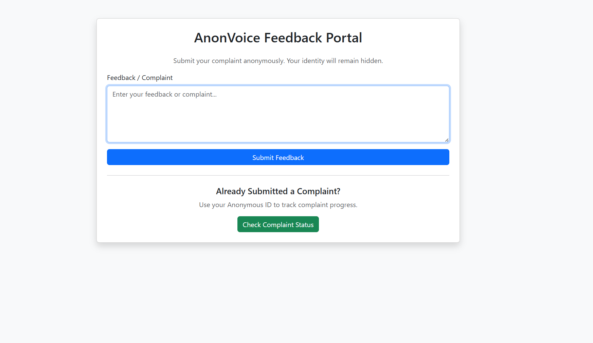
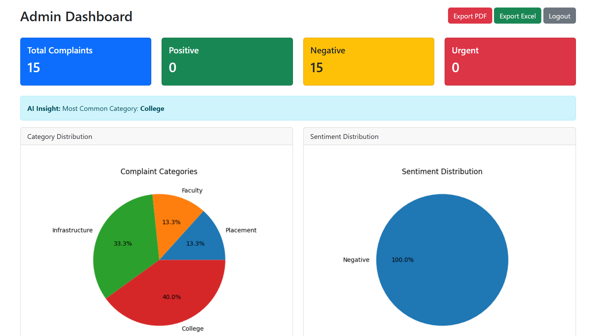
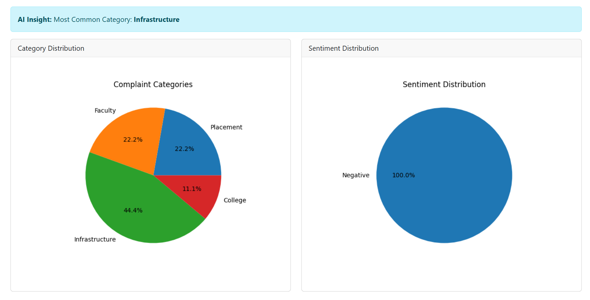
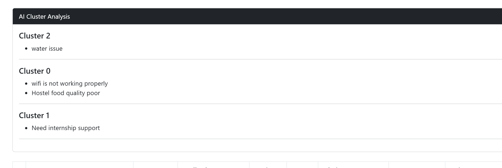
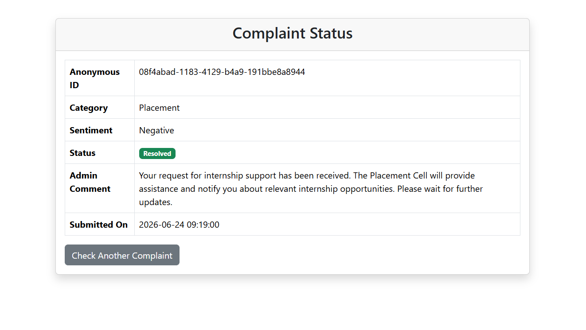

# AI-Powered Anonymous Student Feedback & Complaint Analysis System

## 📌 Project Overview

The AI-Powered Anonymous Student Feedback & Complaint Analysis System is a Flask-based web application that enables students to submit complaints anonymously while providing administrators with powerful analytics and machine learning insights.

The system protects student identity using anonymous IDs and encrypted feedback storage. It automatically analyzes complaints using Machine Learning techniques such as Sentiment Analysis, Category Prediction, and KMeans Clustering to help administrators identify patterns and take action efficiently.

## 🎯 Problem Statement

In many educational institutions, students hesitate to submit complaints due to fear of identification or retaliation. Traditional feedback systems often lack anonymity, analytics, and intelligent complaint categorization.

This project addresses these issues by providing a secure and intelligent platform for anonymous complaint submission and analysis.

## ✨ Features

### Student Features

* Submit complaints anonymously
* Unique Anonymous ID generation
* Track complaint status
* View admin comments
* Secure encrypted feedback storage

### Admin Features

* Admin login dashboard
* View all complaints
* Search complaints
* Update complaint status
* Add admin comments
* Delete complaints
* Export reports to Excel and PDF

### Machine Learning Features

* Sentiment Analysis (Positive, Negative, Urgent)
* Automatic Category Prediction
* KMeans Complaint Clustering
* AI-Powered Complaint Insights

### Data Visualization

* Complaint Category Pie Chart
* Sentiment Distribution Pie Chart
* Dashboard Analytics

## 🛠️ Tech Stack

### Frontend

* HTML5
* CSS3
* Bootstrap 5

### Backend

* Flask
* Python

### Database

* SQLite

### Machine Learning

* Scikit-Learn
* TF-IDF Vectorizer
* Multinomial Naive Bayes
* KMeans Clustering

### Data Analysis & Visualization

* Pandas
* Matplotlib

### Security

* Feedback Encryption
* Anonymous ID Generation

### Reporting

* Excel Export (Pandas)
* PDF Export (ReportLab)

## 📸 Screenshots

### 🏠 Home Page

### 📊 Admin Dashboard

### 📈 Analytics Charts

### 🤖 AI Cluster Analysis

### 🔄 Student Complaint Status Portal

## 🤖 Machine Learning Models

### 1. Sentiment Analysis

The system automatically classifies complaints into:

* Positive
* Negative
* Urgent

Techniques Used:

* TF-IDF Vectorization
* Multinomial Naive Bayes

---

### 2. Automatic Category Prediction

The system predicts complaint categories such as:

* Faculty
* Placement
* Infrastructure
* College
* Other

Techniques Used:

* TF-IDF Vectorization
* Naive Bayes Classification

---

### 3. KMeans Complaint Clustering

The system groups similar complaints together to identify common issues and patterns.

Example Clusters:

* Infrastructure Issues
* Faculty Related Issues
* Placement Related Issues 

Techniques Used:

* TF-IDF Vectorization
* KMeans Clustering

## 🚀 Future Enhancements

* Email Notifications for Complaint Updates
* Real-Time Dashboard Analytics
* Role-Based Access Control
* Mobile Application Integration
* AI Chatbot for Student Support
* Advanced NLP-Based Complaint Summarization
* Cloud Deployment using AWS or Azure
* Real-Time Complaint Monitoring

## ⭐ Key Highlights

* Anonymous Complaint Submission
* Secure Data Encryption
* Sentiment Analysis using Machine Learning
* Automatic Complaint Category Prediction
* KMeans Complaint Clustering
* Interactive Analytics Dashboard
* Complaint Status Tracking
* Admin Comments System
* Excel and PDF Report Generation
* Student Complaint Tracking Portal

### Connect With Me

* GitHub: https://github.com/Rs2587

## 📜 License

This project is licensed under the MIT License.

